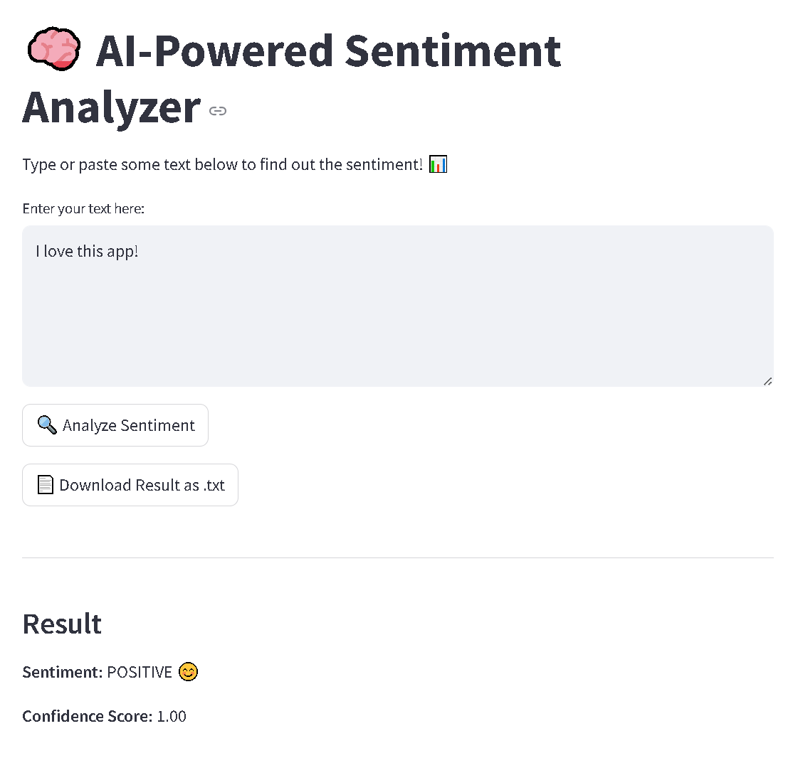

# Sentiment Analysis Web App 🧠💬

This is a simple web application that uses machine learning to analyze the sentiment of user-provided text. It provides a sentiment label (positive/negative/neutral) and a confidence score for each analysis.

## 🎯 Features

- **Sentiment Classification**: Classifies text as positive, negative, or neutral.
- **Confidence Scores**: Provides confidence scores for each sentiment label.
- **Downloadable Results**: Users can download their analysis results as a `.txt` file.

## 🛠️ Technologies Used

- **Streamlit**: For creating the interactive web interface.
- **Transformers (Hugging Face)**: For pre-trained models (BERT-based).
- **TensorFlow**: To run the machine learning models.

## 🔧 Installation

To run this project locally, follow these steps:

1. Clone the repository:
   ```bash
   git clone https://github.com/your-username/ai-sentiment-analyzer.git
   ```
2. Install dependencies:
    ```bash
    pip install -r requirements.txt
    ```
3. Run the Streamlit app: 
    ```bash
    streamlit run app.py
    ```

## 📄 Example
